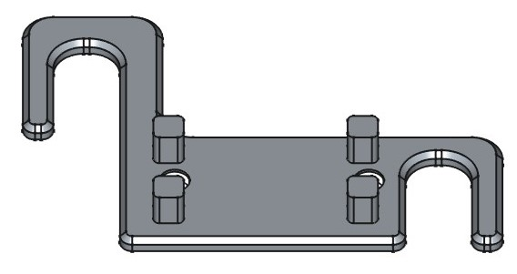

# 3dmodels

**license** all files in repository is under  CC BY-NC 4.0  [Attribution-NonCommercial 4.0 International](https://creativecommons.org/licenses/by-sa/4.0/ https://creativecommons.org/licenses/by-nc/4.0/)

Desing by using FreeCad 1.0.  
---
* [8bitdo-clr-holder.FCStd](8bitdo-clr-holder.FCStd) - under shelf holder for 8BitDo controller. 
	Made reverse engineering of the joysticks positions on 8BitDo gamepad.

	

* [vesa200raspberypi5](vesa200raspberypi5.FCStd) - VESA200 bracket for raspberry Pi

	

* [ender3peak](ender3peak.FCStd) - crest for 3d printer "ender 3 v3". A comb on top of the printer for clamping it in a "vice" adds stability to the printer.
* [pipePlug](pipePlug.FCStd) - pipePlug + pice of "joker pipe" =  tape roll holder

